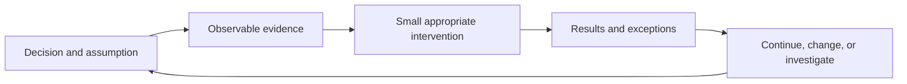

# The Lean Startup: Summary, MVP Experiments, and Decision Log

<!-- BOOK-HEADER:START -->


[Official book information and buying options](https://theleanstartup.com/)

Cover: via Open Library; artwork remains the property of its respective rights holders. [Image source](https://openlibrary.org/isbn/9780307887894).
<!-- BOOK-HEADER:END -->

**Eric Ries · Startup experiments and evidence-based decisions**

[Summary](#summary) · [Choose an MVP](#choose-an-mvp-that-tests-the-assumption) · [Metrics](#measure-behavior-with-a-defined-denominator) · [Decisions](#pivot-persevere-or-repair-the-test) · [Troubleshooting](#when-an-experiment-goes-wrong)

[Experiment worksheet](worksheet.md) · [Worked example](worked-example.md) · [Playbook](../../playbooks/startup-experiment-planner.md) · [AI skill](../../skills/startup-experiment-planner/SKILL.md)

Your team can ship quickly and still learn very little. A release, a busy launch week, and a growing signup total can all coexist with uncertainty about whether anybody needs the product enough to keep using it.

This guide helps you turn an uncertain business assumption into an experiment, then turn its results into a decision. The practical output is an experiment plan with an auditable result review. The examples and decision tools are original applications; they are not cases or official worksheets from the book.

## Summary

Eric Ries presents entrepreneurship as work under uncertainty that needs its own management approach. Progress comes from testing consequential assumptions, measuring customer behavior, and using what happens to guide the next investment. Build–Measure–Learn connects those activities. A minimum viable product starts the learning process; it is not simply a smaller version of the product you already wanted to build. Innovation accounting makes learning visible enough to support decisions about continuing or changing direction. [Author's methodology](https://theleanstartup.com/principles).

For a founder, this changes the question behind a feature request. Instead of asking only how fast the team can deliver it, ask what uncertainty it addresses and what outcome would make you choose differently. A feature that nobody uses may still teach something, but only if the team knows what was offered, who encountered it, and what actually happened.

## When to use this toolkit

Use it when an important decision depends on evidence you do not yet have: whether a customer will adopt a new workflow, whether a service can be delivered within a cost limit, or whether a particular offer leads to a real purchase.

If you cannot describe the problem or the customer's existing routine, begin with [The Mom Test](../the-mom-test/README.md). Interviews can help you formulate a testable assumption. They cannot substitute for observing whether a specific intervention works. Conversely, if the task is a routine defect with a known cause, fix it; do not manufacture an experiment around every ordinary engineering decision.

The worksheet is also useful after a test has run. Preserve the original rules and mark any later interpretation as retrospective. If there was no original rule, say so rather than inventing one that makes the result look successful.

## Separate the assumptions before choosing a test

“We need a scheduling app” bundles several claims. Tutors might have a coordination problem, might want assistance with it, might use a particular workflow, and might pay enough to cover delivery. These claims require different evidence.

| Assumption | Evidence that could inform it | Evidence that would be insufficient |
| --- | --- | --- |
| A problem occurs in a relevant situation | Recent incidents and the existing workaround | General agreement that scheduling is annoying |
| A proposed workflow is usable | Someone completes the relevant task | Someone likes a mockup |
| The intervention delivers a useful result | Outcomes during actual use, with limitations recorded | A waitlist signup |
| Delivery is operationally feasible | Effort, errors, and exceptions during fulfillment | A polished interface |
| A particular offer is acceptable | A real decision under stated price and terms | A hypothetical price answer |
| Use will repeat | Behavior across relevant later opportunities | One successful first session |

Choose an assumption whose failure would change the next investment and for which a feasible test can produce useful evidence. The most uncertain claim is not always the next one to test: a missing prerequisite can make its experiment uninterpretable. If participants cannot access the workflow, a trial tells you little about repeat use.

Write the current evidence beside the assumption. “Three people described the problem” is more informative when you also know how they were recruited, whether they meant the same problem, and whether any described an adequate solution.

## Plan Build–Measure–Learn backward

The action sequence is to build, measure, and learn. Planning becomes more useful when you start with the decision you need to make.

1. **Decision:** What commitment are you considering? State it concretely, such as spending two weeks automating a confirmation workflow.
2. **Learning needed:** What would make that commitment sensible or premature? Identify the assumption and a plausible result that would change your mind.
3. **Observation:** What behavior or operational result would bear on that assumption? Define it before choosing a dashboard.
4. **Intervention:** What can you responsibly offer that creates the opportunity to observe it?
5. **Review:** Who will interpret the result, when, and alongside which constraints?

Our fictional founder Maya initially wants to build automatic reminders. Her nearer decision is whether there is a repeatable confirmation process worth automating. A manually delivered service can reveal steps, exceptions, and effort before she writes that automation. It cannot establish the reliability of software she has not built.



## Choose an MVP that tests the assumption

Ries defines an MVP around learning with limited effort, and explicitly warns that selecting one requires judgment. The point is not to minimize features regardless of what you need to find out. [His MVP introduction](https://www.startuplessonslearned.com/2009/08/minimum-viable-product-guide.html).

The options below are our experiment-design comparison. None is the default for every startup.

| Intervention | A useful question | What remains unknown |
| --- | --- | --- |
| A clearly described offer page | Will relevant visitors take the stated next step? | Whether they can use the product or retain value |
| An interactive prototype | Can someone understand and complete this task? | Reliability, repeated use, and payment behavior |
| An openly manual service | Can this process deliver the intended result, and what work does it require? | Whether automation can deliver it economically |
| A narrow working feature | Will people use this capability in context? | The viability of a broader product or business |
| A scoped paid pilot | Will suitable buyers accept this offer and use what is delivered? | Retention beyond the pilot and scalable acquisition |

Select the option by tracing its observations back to the assumption. If the question is whether people will pay, a prototype usability session is a poor substitute for a genuine commercial decision. If the question is where a workflow fails, selling access before you understand the workflow can obscure the issue.

Keep quality requirements tied to what participants need and what could go wrong. The author rejects the idea that an MVP requires putting people or reputation at unacceptable risk. A narrower audience, controlled setting, or different intervention may be the appropriate way to learn. [MVPs and Excellence](https://www.startuplessonslearned.com/2015/01/mvps-and-excellence.html).

For Maya's test, the participants know a person is coordinating changes. That disclosure matters because human intervention is part of what they receive. A successful manual outcome must not later be presented as evidence that automatic reminders achieved it.

## Measure behavior with a defined denominator

A metric needs a definition another person can apply. “Confirmation rate” is incomplete until you say what counts as a confirmation, which events are eligible, and when the observation closes.

For the tutor trial, Maya defines an eligible event as an agreed lesson-time change requiring acknowledgment from the tutor and the responsible adult. The outcome is whether both acknowledgments are recorded by the declared cutoff. One event can involve several messages; counting messages as separate successes would inflate the result.

Record at least these distinctions:

- **Unit:** a person, account, transaction, or event. Do not switch units midway through a calculation.
- **Eligibility:** which units had a real opportunity to perform the action.
- **Window:** when observation starts and closes; immature observations may still be pending.
- **Outcome:** the specific behavior counted as success, failure, or unknown.
- **Burden:** time, costs, errors, or other constraints that determine whether the result is usable.

Unknown is not automatically failure, but it must not vanish from the denominator without explanation. If tracking breaks for three events, report the missingness and any bounds you can justify. Do not simply publish the success rate among the convenient remaining records.

### Totals can conceal the change you need to see

Imagine two fictional onboarding cohorts. The first has 20 accounts with 8 activated; the second has 40 accounts with 12 activated, using the same maturity window and definition. Total activations grew from 8 to 20, but the cohort activation rates are 40% and 30%. The increased total alone does not establish that onboarding improved. Different acquisition sources could explain part of the difference, so the cohort comparison is descriptive rather than a causal conclusion.

Use the denominator that answers the decision. If participants never had another lesson change, they did not have another opportunity to use the confirmation workflow. An opportunity-based repeat-use measure and a weekly account-retention measure answer different questions; record both if both matter.

## Innovation accounting as a learning record

Ries's lecture material describes establishing a baseline, trying improvements, and deciding whether to persevere or pivot. That is a useful discipline for exposing progress that a shipping schedule cannot show. [Author's LSE lecture slides](https://www.lse.ac.uk/assets/richmedia/channels/publicLecturesAndEvents/slides/20120112_1830_theLeanStartup_sl.pdf).

Our application is a compact experiment ledger: preserve the assumption, intervention version, exposure, outcome, burden, and decision for each test. If the baseline is unavailable, state that the first test may establish it. Do not invent a historical comparison because a template includes a baseline field.

Changing several important things at once may be necessary, but it limits attribution. If Maya changes the participant segment, script, deadline, and operator between rounds, an improved rate does not identify which change mattered. Record those differences so the next review does not tell a cleaner story than the evidence supports.

## Pivot, persevere, or repair the test?

A review should not collapse every disappointing result into “pivot.” First ask whether the test created the intended opportunity and measured it adequately.

| Result pattern | Interpretation to examine | Reasonable next action |
| --- | --- | --- |
| Almost no relevant people saw the offer | Exposure or recruitment may be inadequate | Repair access before judging demand |
| People entered but could not complete setup | Execution obscures the intended behavior | Fix the blocker and repeat the relevant portion |
| Outcome improved but delivery effort was excessive | Value and feasibility point in different directions | Investigate the costly steps before scaling |
| A benefit appears only in one distinct situation | The segment may be too broad | Compare that situation explicitly |
| Repeated adequate tests challenge a central assumption | The strategy may need a substantive change | State a new hypothesis and what changes |
| The local decision rule passes | The next bounded investment may be justified | Continue while preserving unresolved risks |

A pivot changes something consequential about the strategy; an iteration changes how the current hypothesis is implemented. A better status label may be an iteration. Moving from solo tutors to tutoring centers changes the customer hypothesis and needs fresh investigation. Neither decision follows automatically from a single small sample.

Do not move the goalposts silently. If a predeclared rule proves poorly chosen, explain why it is being replaced and assess the old result under the old rule. Then use the revised rule prospectively.

## Worked decision: improvement is not enough

In the [completed example](worked-example.md), Maya's first manual trial records ten acknowledged changes out of twelve eligible events. A quick promotional account might describe this as an 83% success rate and a reason to automate.

The full record says more. Two changes remain unresolved, median operator effort is eight minutes, and the two most expensive events involve an unanticipated approval handoff. The predeclared rule required no unresolved events and at most five minutes median effort. Neither condition passes. There is also no comparable baseline that would justify claiming an improvement.

The example therefore postpones automation, investigates the exception path, and designs a narrower second test. It shows the event log, calculations, rejected interpretations, and revised plan. All participants and results are fictional; their purpose is to demonstrate judgment, not establish product demand.

## When an experiment goes wrong

**The test returns enthusiasm but no relevant action.** Check what participants were asked to do. A favorable opinion cannot answer a behavioral question. Change the opportunity, not merely the wording of the conclusion.

**The result is below the target, but delivery broke.** Record which failures are implementation defects and which occurred despite adequate delivery. Repairing a defect may be justified, but do not discard those events as though customers never experienced them.

**The result looks good only after exclusions.** Reconstruct the original inclusion rules. Show excluded and missing records, their reasons, and whether the interpretation depends on removing them.

**The team wants an exact success threshold with no basis.** Start from the decision's economics, service promise, or risk tolerance. If those are unknown, propose a calibration test. A round percentage selected for convenience is not market validation.

**Everyone wants another experiment indefinitely.** Name the decision that the next test will resolve, its cost ceiling, and the result that would stop further investment. Learning has a cost; collecting more information is not always the best use of limited resources.

## Frequently asked questions

**Is The Lean Startup only for software?** Its learning approach can inform uncertain products and services. The appropriate intervention depends on what must be learned and what can be tested responsibly.

**Does an MVP prove product-market fit?** No. One experiment can inform a bounded assumption. Persistent customer value, retention, acquisition, and delivery economics require their own evidence.

**How many participants are enough?** There is no universal number here. An exploratory operational trial can uncover failure modes without estimating market demand. A quantitative comparison needs a design suited to the effect and uncertainty you are trying to resolve.

**Must a test include payment?** Only when the question requires a commercial decision. Payment adds relevant evidence about a particular offer; it does not automatically establish retention or profit.

**What can the AI skill do?** Draft a test, critique an existing plan, analyze a supplied event log, and revise a next-test proposal. It keeps missing evidence visible and distinguishes those outputs from running a real experiment.

## Use the toolkit

Start with the [experiment worksheet](worksheet.md). Use the [playbook](../../playbooks/startup-experiment-planner.md) for the full planning-to-review sequence and the [worked example](worked-example.md) to see an unfavorable result handled explicitly.

```bash
npx skills add dreaduva/business-books-applied --skill startup-experiment-planner
```

Example request: “Review my MVP test before I run it. Tell me which assumption it can actually test, repair the metric definitions, and preserve anything we still do not know.”

## Sources and scope

- [The Lean Startup methodology](https://theleanstartup.com/principles): learning, management, and the feedback loop.
- [Eric Ries — Minimum Viable Product: a guide](https://www.startuplessonslearned.com/2009/08/minimum-viable-product-guide.html): learning purpose and context-dependent MVP choice.
- [Eric Ries — MVPs and Excellence](https://www.startuplessonslearned.com/2015/01/mvps-and-excellence.html): quality and responsible experimentation.
- [Eric Ries — LSE lecture slides](https://www.lse.ac.uk/assets/richmedia/channels/publicLecturesAndEvents/slides/20120112_1830_theLeanStartup_sl.pdf): innovation accounting and progress decisions.
- [Publisher's book record](https://www.penguinrandomhouse.com/books/210088/the-lean-startup-by-eric-ries/): book and cover-edition identity, ISBN 9780307887894.

This is an independent application of the cited public materials, not a chapter-by-chapter account of the full book. The worksheet, fictional scenarios, and analysis procedures are original project material.

[All books](../README.md) · [All skills](../../skills/README.md)
