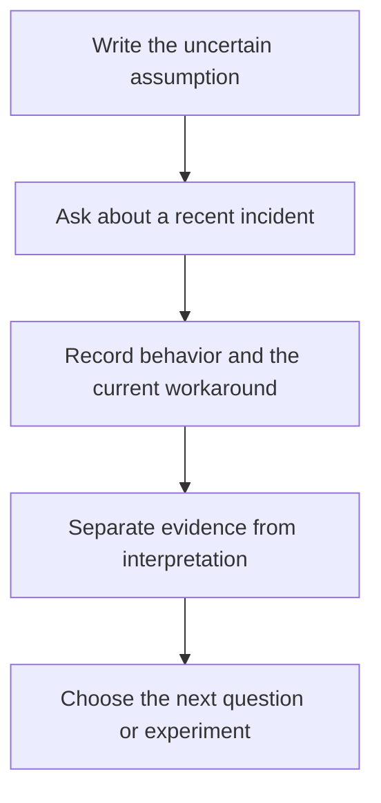

# The Mom Test: Summary and Customer Interview Questions

<!-- BOOK-HEADER:START -->


[Official book information and buying options](https://www.momtestbook.com/)

Cover: via Open Library; artwork remains the property of its respective rights holders. [Image source](https://openlibrary.org/isbn/9781492180746).
<!-- BOOK-HEADER:END -->

**Rob Fitzpatrick · Customer discovery · Original-edition guide**

**Complete toolkit · v1.0** — [Plan an interview](interview-plan.md), [review questions](question-checklist.md), [analyze notes](../../skills/customer-interview-planner/assets/research-debrief.md), and [choose the next test](../../skills/customer-interview-planner/assets/next-test.md).

[Summary](#the-mom-test-summary) · [Three rules](#the-three-rules-in-practice) · [Interview questions](#customer-interview-questions-move-from-opinions-to-incidents) · [Commitment](#compliments-interest-and-commitment) · [Worked example](#worked-example-the-calendar-was-not-the-starting-point) · [FAQ](#frequently-asked-questions)

[All books](../README.md) · [Interview template](interview-plan.md) · [Worked example](worked-example.md) · [Question checklist](question-checklist.md) · [AI skill](../../skills/customer-interview-planner/SKILL.md)

[Follow the customer interview playbook](../../playbooks/customer-interviews.md)

If every customer conversation ends with “That sounds useful,” you may have learned very little. People can like you, like the idea of your product, and still have no reason to change what they do.

*The Mom Test* is useful when you need a better conversation before you need a better pitch. This guide explains the central approach and develops an original interview-planning exercise for a founder exploring scheduling software.

## The Mom Test summary

The book's central concern is the quality of the evidence you get from customer conversations. General opinions and predictions about future behavior are easy to give. Specific accounts of a recent problem, the workaround someone used, and what it cost them are more useful starting points.

That changes your job in the conversation. Instead of persuading someone that your idea makes sense, try to understand their existing situation. Ask follow-up questions before explaining your solution. Pay attention to concrete behavior and meaningful next steps rather than treating enthusiasm as a sale.

Fitzpatrick's [official book page](https://www.momtestbook.com/) describes its focus on practical customer conversations. His [teaching guidance](https://www.momtestbook.com/teachers) highlights question quality, biased data, and commitment. The exercise below is our own application of those ideas.

## Who this helps

Use this guide if you have a target customer and an uncertain problem to investigate. It is particularly relevant before you commit substantial time to building a product.

It is less useful if your immediate problem is acquiring enough customers for an already proven offer. Interview technique is one part of customer discovery; it cannot replace market access, a viable offer, or a purchase decision.

## The three rules in practice

The book's three central rules, paraphrased, are to focus on the customer's situation, ground questions in specific past events, and spend more of the conversation listening. Here is an original way to turn them into interview habits:

| Principle | What to do in the conversation | Warning sign |
| --- | --- | --- |
| Start with the person's experience | Explore the job they were trying to finish and what got in the way. | You spend the opening explaining your product. |
| Ask about a real event | Anchor the discussion in one recent incident, then follow its sequence. | The answer describes an ideal future without a concrete example. |
| Leave room for the answer | Ask a short question, pause, and follow up on what you heard. | You finish the participant's sentence or suggest the answer. |

Listen for a sequence you can reconstruct. A short clarification is more useful than silently accepting a vague answer.

## Customer interview questions: move from opinions to incidents

Suppose you are considering appointment software for independent tutors. You suspect that schedule changes create administrative work. That suspicion is a starting hypothesis, not a finding.

| A question that risks leading the answer | A more useful way to investigate |
| --- | --- |
| Would a simpler calendar help you? | Walk me through the last lesson you had to reschedule. |
| Do you waste a lot of time on messages? | What did you do after the student asked to change the time? |
| Would you pay for automatic reminders? | What have you already tried to make confirmations easier? |
| Is this one of your biggest problems? | What else competed for your attention that week? |
| Would you use my app? | How did you choose the tool or process you use now? |

These are original practice questions, not quotations from the book. They are useful because they leave room for an inconvenient answer. A tutor might tell you that cancellations are rare, that a calendar already solves the problem, or that the real difficulty is collecting payment.

Follow the detail that matters. If a tutor says they sent “a lot” of messages, ask them to describe a recent exchange. If they cannot recall an incident, do not fill in the gap for them.

## Compliments, interest, and commitment

Fitzpatrick distinguishes learning about a customer's situation from moving a real opportunity forward. In [his interview with SaaS Club](https://saasclub.io/podcast/saas-idea-validation-rob-fitzpatrick/), he explains why encouraging comments are weak evidence of purchase intent and why a concrete next step matters. His [teacher resources](https://www.momtestbook.com/teachers) also identify commitment and advancement as core topics.

For the tutor example, those distinctions look like this:

| Signal | What you can reasonably conclude | What you cannot conclude |
| --- | --- | --- |
| “That sounds handy.” | The person responded positively. | They have a costly problem or will use the product. |
| They describe a recent coordination problem. | There is a specific incident to investigate. | The problem is common across the market. |
| They arrange a follow-up to show their workflow. | They have committed time to the next conversation. | They have committed to a purchase. |
| They introduce you to the person who chooses software. | The conversation can progress toward a relevant decision-maker. | The decision-maker will approve the product. |

Choose a next step that fits the stage and respect a refusal. Do not push a deposit request into an exploratory conversation when you cannot yet describe or deliver the offer. A declined meeting may reflect timing or trust, not the absence of a problem.

## A small interview plan you can use

**Write one learning objective.** For example: “Understand what independent tutors currently do when a student changes a lesson time.” Avoid objectives such as “Validate our scheduling app,” which can encourage you to defend the answer you want.

**Recruit for a relevant situation.** Someone who has not taught an individual lesson recently may be an interesting person to talk to, but may not help answer this particular question. Record why each participant is relevant. A convenient sample is not automatically a representative one.

**Prepare a few prompts and room to follow up.** Start with a recent incident, then explore the sequence, tools, effort, consequences, and alternatives. An interview guide should support attention, not turn the conversation into a rigid survey.

**Keep evidence separate from interpretation.** “Sent four messages after one cancellation” is a description of an event. “Needs our reminder feature” is your interpretation. Put them in different fields so the second cannot quietly replace the first.

**Decide what to investigate next.** A pattern across conversations may justify a narrower experiment. An isolated complaint may justify another question. Neither requires you to declare the whole business validated.

Copy the [customer interview plan](interview-plan.md) to use these steps.



*Original workflow diagram from Business Books, Applied.*

## Worked example: the calendar was not the starting point

The following is a **fictional teaching example**. No real interviews were conducted.

A founder initially proposes a nicer booking calendar for independent tutors. In the example interview, a tutor already has a working calendar. The awkward part is confirming a change with both a student and a parent: the tutor describes a recent incident involving several messages and uncertainty about whether everyone saw the new time.

The sensible next move is to investigate that coordination problem. It would be premature to conclude that a new calendar is needed, that most tutors share the problem, or that anyone will pay for a solution.

| Note | What it means |
| --- | --- |
| Existing calendar works for normal bookings | The original feature idea may not address the troublesome situation. |
| A schedule change required several messages | There is a specific workflow worth understanding better. |
| No buying behavior was observed | Willingness to pay remains unknown. |
| Only one fictional participant is described | This demonstrates a method, not market evidence. |

The [completed example](worked-example.md) fills every field in the interview template, then compares three fictional notes from two participants and completes a next-test card.

<details>
<summary>Read a short fictional conversation and its annotations</summary>

**Founder:** Walk me through the last lesson you had to move.

**Tutor:** A student asked to change Tuesday's lesson. I found a Thursday slot and changed my calendar.

**Founder:** What happened after you changed it?

**Tutor:** I messaged the student. Their parent pays, so I messaged the parent too. The student replied, but the parent didn't. I wasn't sure whether we were all working from the same time.

**Founder:** How did you handle that?

**Tutor:** Another message the following morning. It was sorted eventually.

**Founder:** How does that compare with a normal week?

**Tutor:** Most weeks are fine. This one was awkward because the parent was traveling.

**What the founder learned:** there was a coordination incident, but the participant describes it as unusual. That last answer weakens the assumption that it is a frequent problem. The founder should record both facts, rather than keeping only the inconvenient messages that support the product idea.

**What is missing:** no verified cost, no evidence from other tutors, no comparison of existing solutions, and no buying behavior.

</details>

## From interview notes to a decision

Use the [research debrief](../../skills/customer-interview-planner/assets/research-debrief.md) to give each note an ID and separate reported behavior from interpretation. Group comparable situations before looking for patterns. A tutor communicating with a parent may face a different workflow from one scheduling directly with an adult student.

For each finding, include supporting and conflicting note IDs. If someone says an incident was unusual, retain that detail beside the incident. A pattern can justify further investigation without establishing how common it is across the market.

Finish with the [next-test card](../../skills/customer-interview-planner/assets/next-test.md): identify the remaining uncertainty, the action that could resolve it, the observable signal, and what would make you stop. These are original project tools. The [playbook](../../playbooks/customer-interviews.md) takes you through preparation, the conversation, the debrief, and the decision.

## What this approach cannot tell you by itself

A careful conversation still has limits. People forget details. Your recruitment choices affect what you hear. A painful incident can be unusual, and a problem worth discussing may not be worth paying to solve.

Use interviews to improve your understanding and decide what evidence to seek next. If the next question is whether someone will adopt or buy a specific offer, design an appropriate test of that behavior rather than treating a hypothetical answer as proof.

## Use the AI skill

The [Customer Interview Planner](../../skills/customer-interview-planner/SKILL.md) supports interview planning, question revision, analysis of supplied notes, and next-test design. The installed folder includes the templates, question-design reference, evidence guide, and completed example.

[Install instructions](../../skills/README.md). Example request:

```text
Help me plan interviews with independent tutors about schedule changes.
I suspect confirmations create admin work, but I have no customer evidence.
Prepare questions that investigate the current process without pitching an app.
```

The assistant can help you prepare. It cannot supply real customer evidence or conduct interviews merely by generating plausible answers.

## Should you read the full book?

Consider it if customer conversations are part of your work and you want a fuller treatment of how they go wrong and what to do about it. This guide develops one practical application; it is not a replacement for the book's examples and discussion.

See [the author's book page](https://www.momtestbook.com/) for official information and available formats.

## Frequently asked questions

### Why is it called The Mom Test?

The title captures the problem of asking someone who wants to encourage you whether your idea is good. Better questions make that desire to be supportive less relevant: you are asking what happened in their life, not inviting a verdict on your plans. Fitzpatrick explains that premise in [the author interview](https://saasclub.io/podcast/saas-idea-validation-rob-fitzpatrick/).

### How many interviews should I run?

This guide does not prescribe a magic number. Track what is still uncertain, whether you are hearing genuinely new information, and which segments you have missed. Consistent interview findings can guide the next test; they do not by themselves prove market size or demand.

### Can I ask about price?

You can investigate what someone currently spends, what alternatives they have tried, and how a purchasing decision works. Asking for a hypothetical price is a different kind of evidence from observing a real decision about a specific offer. Be clear about which one you have collected.

### Is there a free PDF or official worksheet here?

This repository provides its own [free interview template](interview-plan.md). It does not distribute the book or an official workbook. The author links authorized purchase formats from [the book's website](https://www.momtestbook.com/).

### Which edition does this guide cover?

The original English-language book, identified here by ISBN **9781492180746**. The cover corresponds to that edition. This guide does not claim to review the revised second edition; check the edition before buying. [Bibliographic record](https://books.google.com/books/about/The_Mom_Test.html?id=ET4cnwEACAAJ).

## Sources

- [The Mom Test — official book page](https://www.momtestbook.com/), accessed 2026-09-17: book purpose and author context.
- [Teacher resources](https://www.momtestbook.com/teachers), accessed 2026-09-17: author-provided teaching topics.
- [Rob Fitzpatrick interviewed on SaaS Club, episode 206](https://saasclub.io/podcast/saas-idea-validation-rob-fitzpatrick/), accessed 2026-09-17: the author's discussion of question quality, learning, and meaningful next steps.
- [Google Books bibliographic record](https://books.google.com/books/about/The_Mom_Test.html?id=ET4cnwEACAAJ): original-edition identity.
- [Open Library cover record](https://openlibrary.org/isbn/9781492180746) and [embedding guidelines](https://openlibrary.org/dev/docs/api/covers): source of the cover thumbnail.

[Back to the catalog](../README.md) · [Follow the playbook](../../playbooks/customer-interviews.md)
